# Star-Wars Hands-on Training Instructions

## Getting Started

## Setting Up Free Account in Neo4j Aura

### Login

Login using your Aura username & password.
Create a new acct if necessary.


### Create a Free Instance
After logging in successfully, click on the New Instance button.
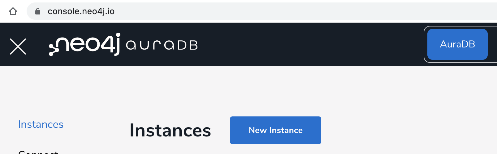

Then Choose Free Instance Type
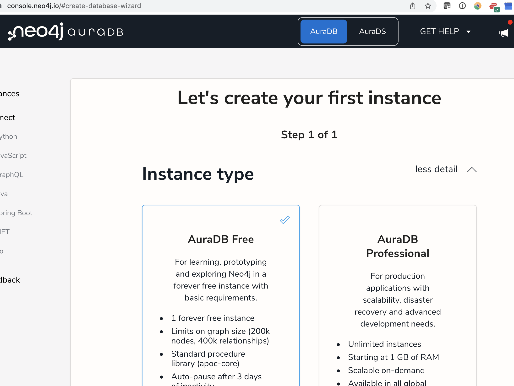

Give it a name.  Case-sensitive, no spaces.
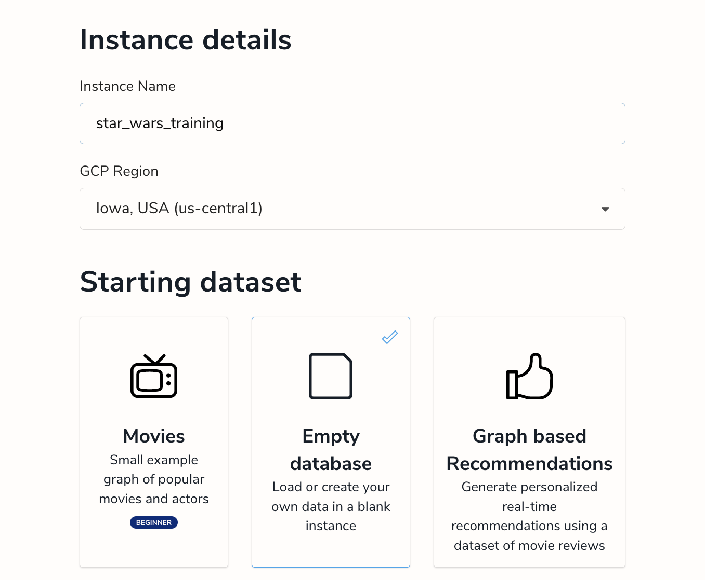

Save your credentials.   This is absolutely critical.  Copy them to the clipboard for use in the next step, but please download the credentials file -and remember where you downloaded it ;)
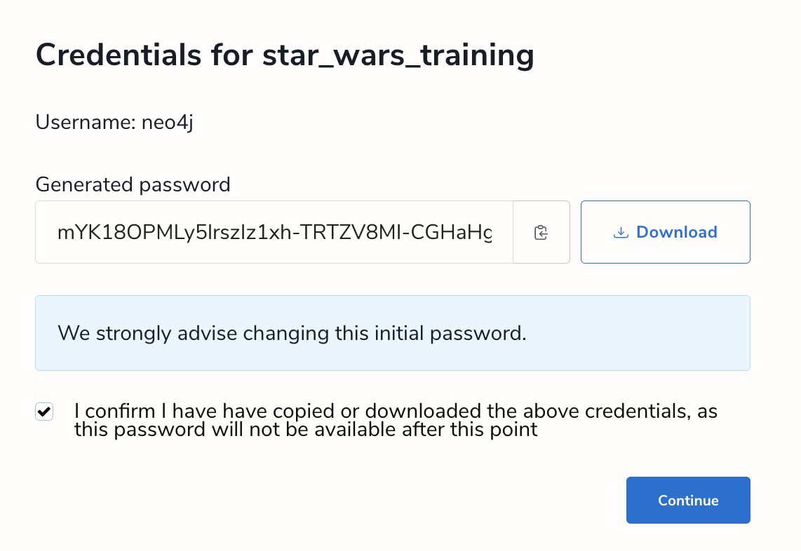

It will take a couple of moments to provision the instance.  The status
will change to running once it's ready and the console will show some basic statistics about the instance as well as the URI for connecting.

1) The Explore button on the right will launch Neo4j Bloom - a visualization tool used for exploring the nodes and relationships in the graph.

2) The Query button will launch the Neo4j Browser - a tool for running ad-hoc Cypher queries

3) The Import button will launch the Neo4j Import Tool - a visual utility tool for importing CSV Files

We will be using each of these during today's session.

We will start with some pre
 Since we'll need to load some data before we can run queries, let's use the Import Tool to load some CSV files.

### Import CSV Files Using the Import Tool

Connect to the instance using the Bolt protocol.  The connection
information is in the credentials that you (hopefully) downloaded.

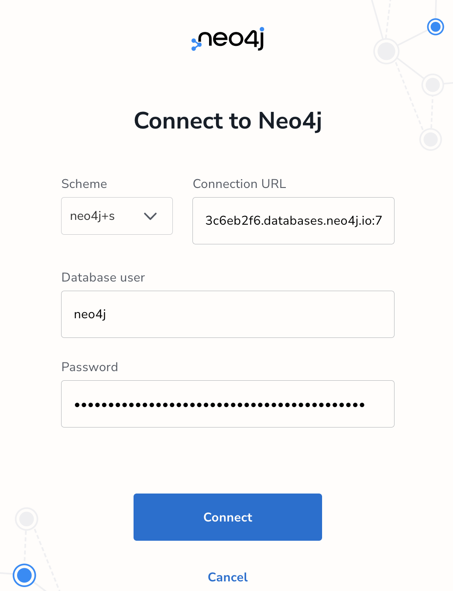

And the Data Importer page should appear - ready for importing.
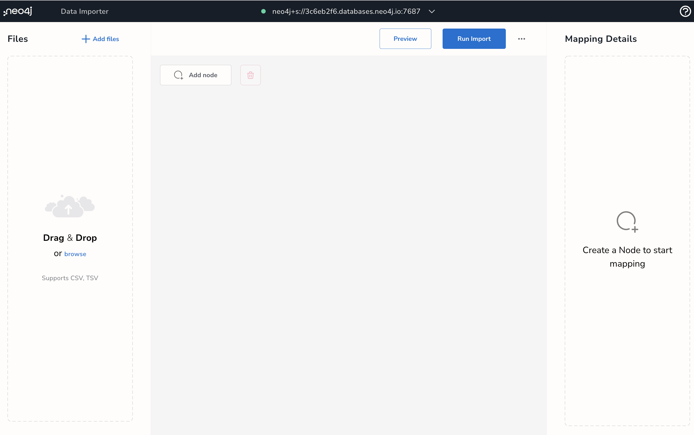


mYK18OPMLy5lrszIz1xh-TRTZV8MI-CGHaHgclhdlm0

## Downloading the CSV Files

The CSV files are available in a zip file on Github.
The Github repo is:
https://github.com/mquinz/star_wars_demo

The zipped CSV files are available at:
https://github.com/mquinz/star_wars_demo/blob/master/data/star_wars_data.zip

Click on the Download button and remember where you downloaded the file.
Then unzip them.

There should be 7 Files:
- characters.csv
- characters-enhanced.csv
- interactions.csv
- planets.csv
- species.csv
- starships.csv
- vehicles.csv

We will use the Neo4j Data Importer for all but the enhanced character file.
We will use the Cypher LOAD CSV command in the Neo4j Browser in a later exercise.

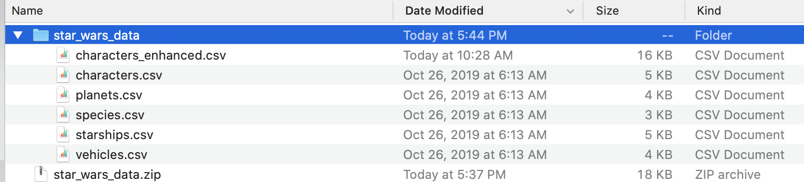

## Using the Data Importer

### Loading CSV Files into the Importer
Return to the Data Importer page and drag the 6 unzipped CSV to the left pane marked "Drag & Drop".
You may also choose them using the Browse link.

After dropping the files in the pane,
each of the files will be opened and a sample row will be displayed.
And the Data Importer page should appear - ready for importing.

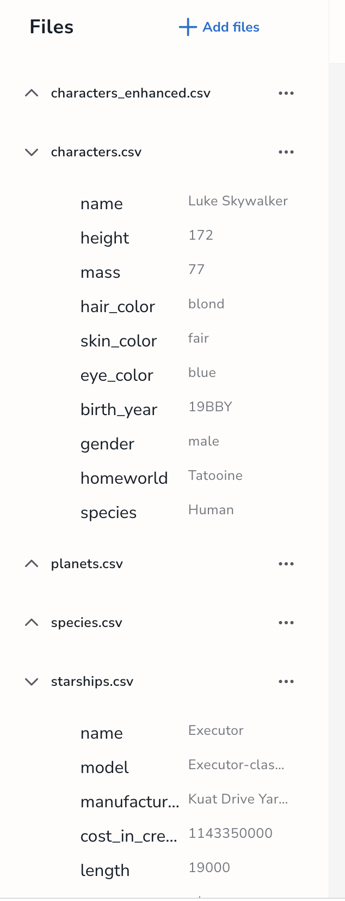

### Adding Nodes

Click on the Add Node button to add a node.  A node without any labels
will appear.  Double-click on the node and type 'Character'.  This tells
the Importer that you will be creating Character nodes.   In the same manner,
create the following nodes:

Node Labels in Neo4j are generally singular, UpperCamelCase, and are case-sensitive.

- Character
- Planet
- Species
- Starship
- Vehicle

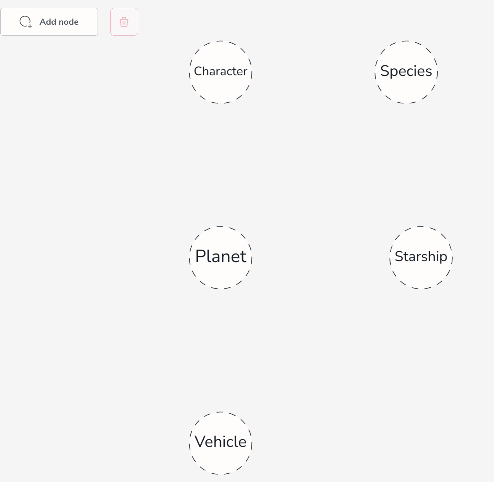

### Creating Node Properties
The Importer will automatically create properties for the nodes using the column names from the CSV files.

To do this, click on one of the Nodes and the Mapping Details pane on the right will display some new fields.
Select the file to be used for that Node.  In the image below the characters.csv file was selected and
the Select From File button was clicked.

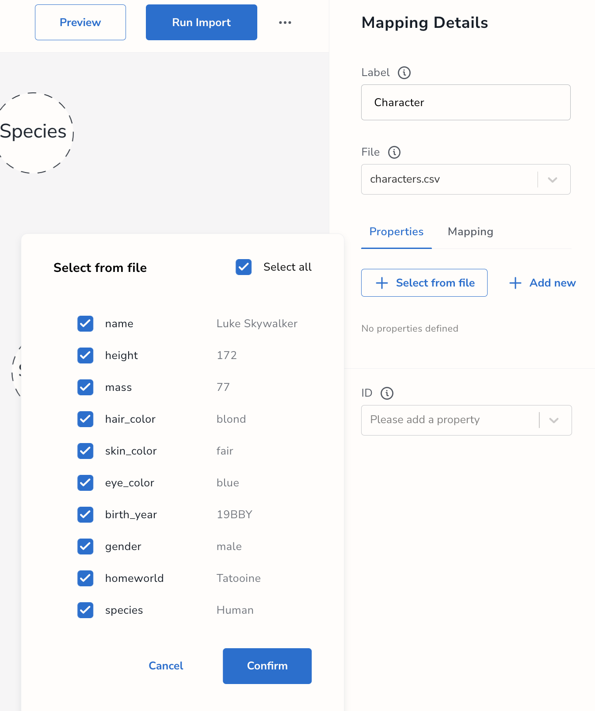

Columns may be added/removed as needed.  After confirming selections, the data types may be edited as needed.
The final step is to select the column that will be used as the primary key/ID.
select_columns


Repeat the process for each of the other Labels.

### Adding Relationships

After the nodes are defined, the relationship may be defined by dragging and dropping a node from one node to another.
The relationship will show as a dashed line.   Click on the dashed line to give the relationship a name (Type).

Specify the name of the file that contains the relationship.  For example,
the Characters.csv file contains a column named species that specifies to which species the character belongs.

The columns that specify the keys of the From node and the To node must be chosen from the fields in the selected file.
The (:Character)-[:IS]->(:Species) relationship can be defined using the character.name field and the character.species field.

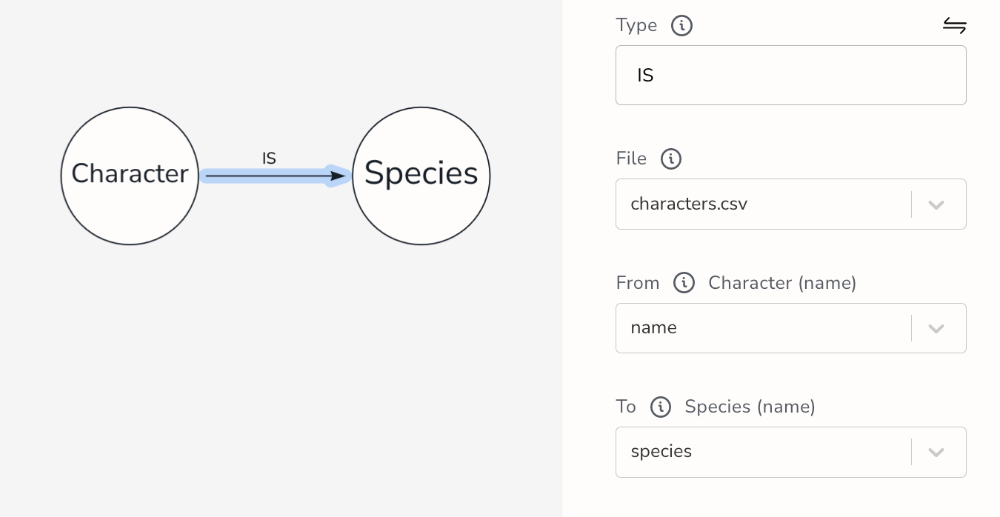

Using this method, define the remaining relationships:
- (:Character)-[:IS]->(:Species)
- (:Character)-[:HOMEWORLD]->(:Planet)
- (:Species)-[:ORIGINATED]->(:Planet)

There is an additional relationship betwen Characters that we will reserve for later.
We will use it to illustrate the Cypher LOAD CSV process in a later exercise.


## Load All nodes
Use the Cypher LOAD CSV command to load all nodes - 1 label at a time.  After the nodes are loaded, we will connect them by creating relationships between them.

### Characters

``` Cypher
// LOAD Characters
LOAD CSV WITH HEADERS FROM
"https://raw.githubusercontent.com/mquinz/star_wars_demo/master/data/characters.csv"
AS row
MERGE (c:Character {name : row.name})
ON CREATE
   SET c.eyeColor = row.eye_color,
       c.gender = row.gender,
       c.weight = toInteger(row.mass),
       c.height = toInteger(row.height),
       c.birthYear = row.birth_year,
       c.skinColors = split(row.skin_color,','),
       c.hairColors = split(row.hair_color,',')

Return c
```


### Starships
``` Cypher

// LOAD Starships
LOAD CSV WITH HEADERS FROM
"https://raw.githubusercontent.com/mquinz/star_wars_demo/master/data/starships.csv"
AS row
MERGE (s:Starship {name : row.name})
ON CREATE
   SET s.model = row.model,
       s.mfg = row.manufacturer,
       s.class =  row.starship_class,
       s.cost = toInteger(row.cost_in_credits),
       s.crew = toInteger(row.crew),
       s.capacity = toInteger(row.cargo_capacity),
       s.cost = toInteger(row.cost_in_credits),
       s.length = toFloat(row.length),
       s.hyperdriveRating = toFloat(row.hyperdrive_rating),
       s.maxSpeed = toInteger(row.max_atmosphering_speed),
       s.mglt = toInteger(row.MGLT),
       s.consumables =  row.consumables

Return s

```


### Planets
``` Cypher

// LOAD Planets
LOAD CSV WITH HEADERS FROM
"https://raw.githubusercontent.com/mquinz/star_wars_demo/master/data/planets.csv"
AS row

MERGE (p:Planet {name : row.name})
ON CREATE
   SET p.rotationPeriod = toInteger(row.rotation_period),
       p.orbitalPeriod = toInteger (row.orbital_period),
       p.diameter = toInteger(row.diameter),
       p.gravity = toFloat(row.gravity),
       p.climate = row.climate,
       p.terrain = split(row.terrain,','),
       p.population = toInteger(row.population)

Return p

```


### Vehicles

``` Cypher

// LOAD Vehicles
LOAD CSV WITH HEADERS FROM
"https://raw.githubusercontent.com/mquinz/star_wars_demo/master/data/vehicles.csv"
AS row
MERGE (v:Vehicle {name : row.name})
ON CREATE
   SET v.model = row.model,
       v.mfg = row.manufacturer,
       v.class =  row.vehicle_class,
       v.cost = toInteger(row.cost_in_credits),
       v.crew = toInteger(row.crew),
       v.capacity = toInteger(row.cargo_capacity),
       v.cost = toInteger(row.cost_in_credits),
       v.length = toFloat(row.length),
       v.maxSpeed = toInteger(row.max_atmosphering_speed),
       v.consumables =  row.consumables

Return v

```


### Species
``` Cypher

// LOAD Species
LOAD CSV WITH HEADERS FROM
"https://raw.githubusercontent.com/mquinz/star_wars_demo/master/data/species.csv"
AS row

MERGE (s:Species {name : row.name})
ON CREATE
   SET s.classification = row.classification,
       s.designation =  row.designation,
       s.avgHeight = toInteger(row.average_height),
       s.avgLifespan = toInteger(row.average_lifespan),
       s.language = row.language,
       s.skinColors = split(row.skin_color,','),
       s.eyeColors = split(row.eye_color,','),
       s.hairColors = split(row.hair_color,',')

Return s

```

### Add Social Network names to existing Characters

``` Cypher
LOAD CSV WITH HEADERS FROM
"https://raw.githubusercontent.com/mquinz/star_wars_demo/master/data/social/characterNames.csv"
AS row

 match (c:Character {name:row.characterName})
set c.socialName = row.socialName

```
### Add new Characters from Social Media

This will create Character nodes using the information from the social network feed for characters that do not match any of the existing nodes.  It will MERGE/CREATE nodes only for the rows with 'none' as the characterName.  For example, the Character Boba Fett already has a socialName so it will be skipped, but the socialName CAMIE does not match any existing Character so they will be added during this step.

```
LOAD CSV WITH HEADERS FROM
"https://raw.githubusercontent.com/mquinz/star_wars_demo/master/data/social/characterNames.csv"
AS row
with row where row.characterName = "none"

MERGE (c:Character {name:row.socialName})
set c.socialName = row.socialName
```
## Load Relationships Between Nodes
By loading the nodes first, creating the relationships use a simple pattern of using MATCH statements to get the From and To nodes, then doing a MERGE for the relationship name.

### Characters -> home Planets , and Characters -> Species

With a single pass through the characters, we can create relationships to both their home planets and to their Species

``` Cypher
LOAD CSV WITH HEADERS FROM
"https://raw.githubusercontent.com/mquinz/star_wars_demo/master/data/characters.csv"
AS row
MATCH (c:Character {name : row.name}),
      (p:Planet {name : row.homeworld}),
      (s:Species {name : row.species}),
MERGE (c)-[:HAS_HOMEPLANET]->(p),
 (c)-[:IS]->(s)

```

### Character Interactions

The interactions.csv file contains relationships between the characters.  This file was created based on script analysis to identify when one character speaks to another.  The source of this data is the Social Network so the keys used here will be the socialName fields.

``` Cypher
LOAD CSV WITH HEADERS FROM
"https://raw.githubusercontent.com/mquinz/star_wars_demo/master/data/social/interactions.csv"
AS row
MATCH (char1:Character {socialName : row.source}),
      (char2:Character {socialName : row.target})
MERGE (char1)-[i:INTERACTED_WITH]->(char2)
     SET i.count = toInteger(row.count)

```
